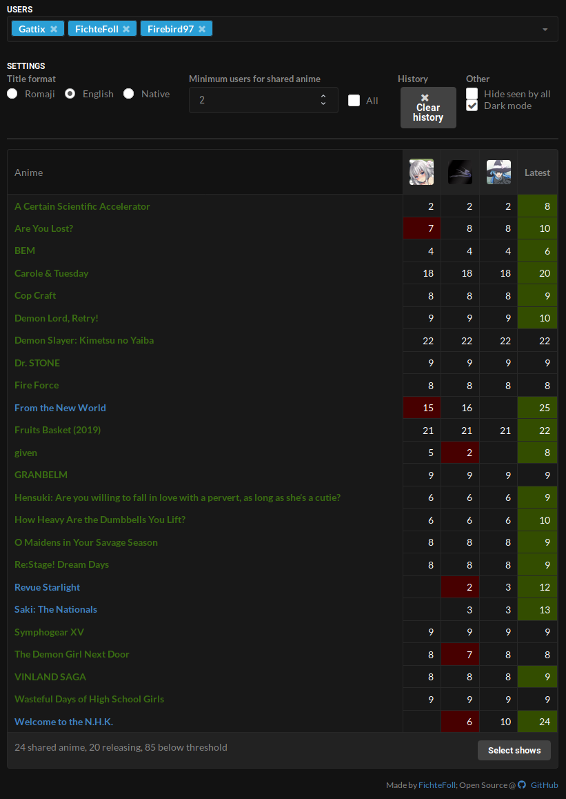

# AniTogether

Use me: <https://fichtefoll.github.io/anitogether/>

When watching (airing) anime together,
but you don't know how far in you are,
AniTogether provides an overview
on the progress of each user specified.

Just enter AniList usernames into the input box
to get a table comparison with all the anime the users watch.
All dynamic content is fetched and rendered on the client,
so you must enable JavaScript.

Thanks to [AniList][] and its very usable API.

[AniList]: https://anilist.co/

## Features

- Show episode progress for each user
- Show users' score on hover
- Highlight anime with unwatched episodes
- Highlight users that are behind compared to the "leader"
  (with the most episodes watched)
- **Simply copy the URL to share your current view with others**
- Save a list of previously entered user names for quick access
- Hide shows you don't care about
- Fancy animations (that are almost entirely fluid)

## Technology

- [Vue.js](https://vuejs.org/)
- [Semantic UI](https://semantic-ui.com/)
  => [Semantic UI Vue](https://semantic-ui-vue.github.io)
- ECMAScript 2018

Incompatible with Internet Explorer (and maybe Edge?).
Use a recent and modern browser.

## TODO

Roughly ordered by priority:

- dark mode
- checkbox that softlocks "minShared" to num of users
- cache per-user results so changing the order or adding/removing
  doesn't request data for ALL users again
- allow removing individual entries from history
- option to include PAUSED anime and highlight this in the table
- something for PLANNED shows
- explore more visual approach where columns are the episode number
  and the user's avatar is inserted in the cells; needs smart collapsing
